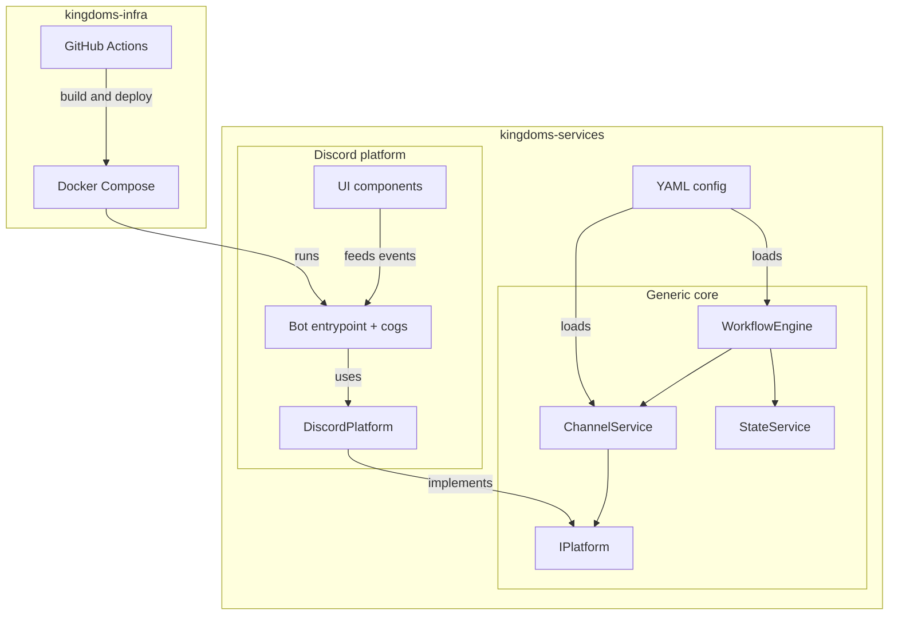
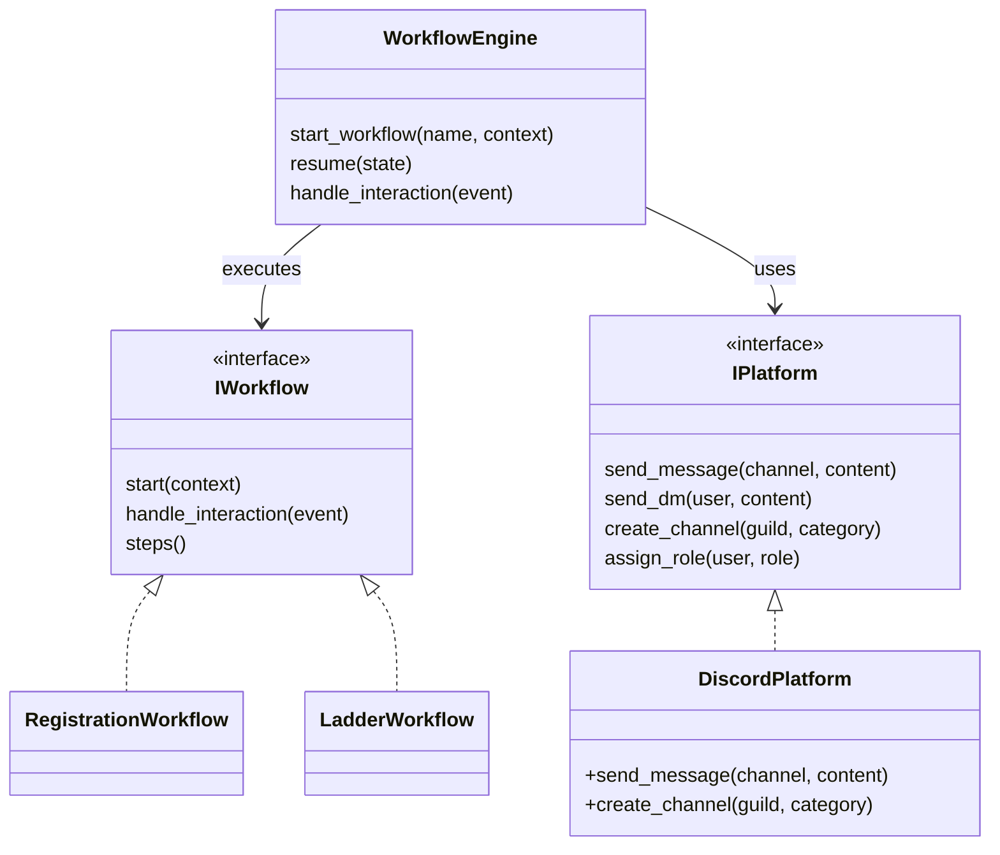
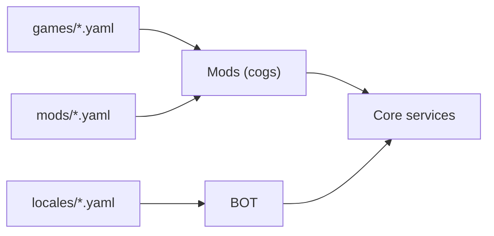
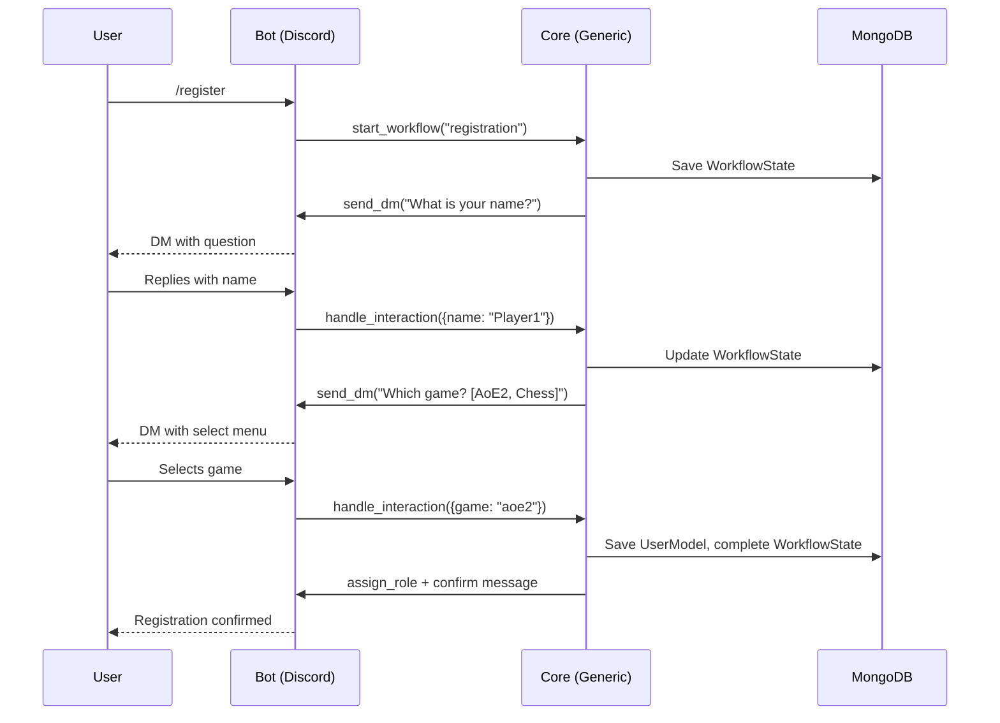
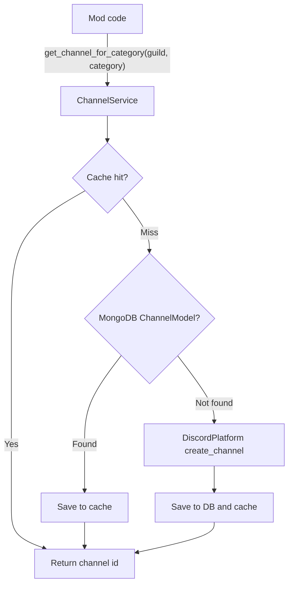
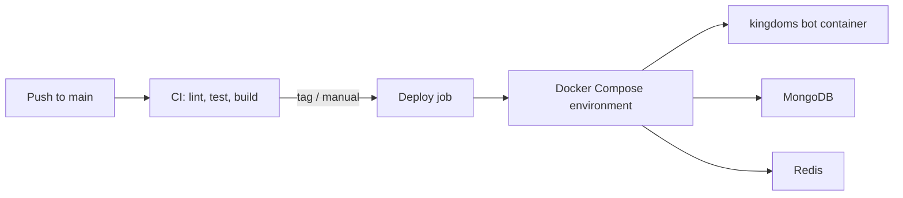

# Architecture

This document describes the technical architecture of Kingdoms: a modular,
multi-platform Discord bot platform. It is the reference for how the three
repositories fit together, how the generic core is organized, and how data
flows through the system.

The five architectural pillars:

1. **Multi-platform**: abstraction via `IPlatform` (Discord now, Twitch/Telegram later)
2. **Modular**: generic core + specific implementations
3. **Workflow-based**: a workflow engine drives interaction sequences
4. **Channel categories**: intelligent message routing (`ADMIN`, `REPORTS`, ...)
5. **GitOps**: deployment via Docker Compose manifests

## 1. Overview

Kingdoms is split across three repositories:

| Repository | Role |
| ---------- | ---- |
| `kingdoms` (this repo) | Source of truth: architecture, workflows, ADRs, mods docs, generated dev docs |
| `kingdoms-services` | All Python code: generic core, Discord platform implementation, mods, YAML configs |
| `kingdoms-infra` | Docker, CI/CD, GitOps manifests, deployment scripts |

### Global architecture

### Data flow between repositories

- `kingdoms` (docs) describes rules and decisions; `kingdoms-services`
  implements them; `kingdoms-infra` deploys the implementation.
- Any code change in `kingdoms-services` or `kingdoms-infra` must come with — or
  be followed by — a doc update in this repo (see [AGENTS.md](../AGENTS.md)).
- Auto-generated technical docs (`docs/DEVELOPMENT/`) are produced from
  `kingdoms-services` sources by the `generate-docs.yml` workflow.

## 2. Generic core (`kingdoms-services/src/kingdoms/core/`)

The generic core contains everything platform-agnostic. Mods and workflows are
written against the core only; they never import Discord-specific code.

### `interfaces/`

- **`IPlatform`**: the platform abstraction. Methods cover messaging
  (send/edit/delete), channel management (create/get by category), role
  assignment, and DMs. First implementation: `DiscordPlatform`.
- **`IMessage`, `IChannel`, `IUser`**: platform-agnostic models exchanged
  between the core and platforms. Adapters convert platform objects to these
  models and back.
- **`IWorkflow`**: contract for an interaction sequence (steps, transitions,
  timeouts). Implemented by concrete workflows and executed by the
  `WorkflowEngine`.

### `models/`

MongoDB-backed persistence models (MongoDB is used for schema flexibility —
workflow payloads evolve with the game rules):

- **`UserModel`**: platform user identity, registration data, per-game profiles
- **`GuildModel`**: per-server configuration (locale, channel category mapping)
- **`ChannelModel`**: channel registry keyed by `ChannelCategory`
- **`WorkflowState`**: persisted workflow instances (current step, payload,
  status) so flows survive restarts

### `services/`

- **`ChannelService`**: channel category management. Mods ask for a channel by
  category, never by name or ID. Resolution order: cache → database → platform
  creation.
- **`WorkflowEngine`**: workflow execution. Declares nothing itself; loads
  workflow definitions, drives step transitions, persists state through
  `StateService`, and dispatches UI events to the right running workflow.
- **`StateService`**: state management in Redis for hot data (current step,
  short-lived payloads), with MongoDB as durable backing store.

### `enums/`

- **`ChannelCategory`**: `ADMIN`, `REPORTS`, `LADDER`, ... — the routing keys
  used by `ChannelService`
- **`PlatformType`**: `DISCORD`, `TWITCH`, ...
- **`WorkflowStatus`**: `PENDING`, `IN_PROGRESS`, `COMPLETED`, `CANCELLED`,
  `TIMED_OUT`

## 3. Discord implementation (`kingdoms-services/src/kingdoms/discord/`)

### `platform/`

- **`DiscordPlatform`**: implements `IPlatform` on top of discord.py
- **`adapters.py`**: converts discord.py objects (`Message`, `TextChannel`,
  `User`/`Member`) to core models (`IMessage`, `IChannel`, `IUser`) and back

### `bot/`

- **`main.py`**: entry point — loads config, wires the core services, starts
  the Discord client
- **`cogs/`**: Discord mods (`register.py`, `ladder.py`, ...). Each cog maps
  commands and interactions to core services; no game logic lives in cogs.

### `ui/`

- **`views.py`**: buttons and select menus
- **`modals.py`**: forms (modal dialogs)
- **`embeds.py`**: rich message builders

UI conventions (persistent views, dynamic items, `custom_id` scheme) are
documented in [architecture/discord.md](architecture/discord.md).

Architecture deep-dives:

- [architecture/core.md](architecture/core.md) — core services design
  (`WorkflowEngine`, `ChannelService`, `StateService`, durable vs hot state)
- [architecture/mods.md](architecture/mods.md) — mod system design
- [architecture/discord.md](architecture/discord.md) — Discord UI components
- [architecture/testing.md](architecture/testing.md) — `MockDiscord` and
  testing strategy

## 4. Configuration (`kingdoms-services/config/`)

All configuration is versioned YAML, loaded at startup:

- **`locales/`**: i18n message catalogs (`en.yaml`, `fr.yaml`)
- **`games/`**: game declarations (`aoe2.yaml`, `chess.yaml`) — name, aliases,
  team size
- **`mods/`**: mod declarations (`register.yaml`, `ladder.yaml`) — enabled
  flags, per-mod settings

## 5. Infra (`kingdoms-infra/`)

- **`deploy/`**: Docker Compose manifests per environment (dev, staging,
  production). One command launches the bot and its dependencies (MongoDB,
  Redis).
- **`.github/workflows/`**: CI/CD — lint, test, build, deploy. Deployment is
  GitOps-style: environments are defined by versioned manifests, and deploys
  are reproducible from the repo state.

## 6. Key diagrams

### Communication flow: registration example

### Channel management

### Deployment flow

## 7. Key decisions

| Decision | Rationale | ADR |
| -------- | ---------- | --- |
| `IPlatform` abstraction | **Extensibility** — Twitch/Telegram later without touching game logic | [ADR-0001](DECISIONS/001-multi-platform-architecture.md) |
| MongoDB | **Flexibility** — dynamic schemas for evolving workflow payloads | — |
| Redis + MongoDB state split | **Responsiveness** — hot state in Redis, durability in MongoDB | [ADR-0002](DECISIONS/002-workflow-engine.md) |
| Channel categories | **Portability** — same mod on any server without code changes | [ADR-0003](DECISIONS/003-channel-categories.md) |
| Docker Compose | **Simplicity** — one command to launch everything | — |
| GitOps | **Reproducibility** — versioned, reviewable environments | — |

New major decisions follow the ADR process in [DECISIONS/](DECISIONS/)
(template: [templates/decision-template.md](../templates/decision-template.md)).

## See also

- [WORKFLOWS.md](WORKFLOWS.md) — game workflow documentation
- [MODS/](MODS/) — per-mod documentation
- [DECISIONS/](DECISIONS/) — architecture decision records
- [AGENTS.md](../AGENTS.md) — repo rules for AI agents
