# Core design

This document is the deep-dive on the generic core
(`kingdoms-services/src/kingdoms/core/`). [ARCHITECTURE.md](../ARCHITECTURE.md)
remains the overview; this page expands the core services design:
`WorkflowEngine`, `ChannelService`, `StateService`, and the split between
durable state (MongoDB) and hot state (Redis).

## Design rules

- The core is **platform-agnostic**: it imports nothing from discord.py. All
  platform access goes through `IPlatform` (see
  [ADR-001](../DECISIONS/001-multi-platform-architecture.md)).
- Mods and workflows are written against the core only.
- The core declares no game rules; it loads them from configuration and mod
  implementations.

## WorkflowEngine

The engine executes multi-step interactions (registration, match reporting)
described by `IWorkflow` implementations (see
[ADR-0002](../DECISIONS/002-workflow-engine.md)).

Responsibilities:

- **Start** a workflow by name with an initial context
- **Route** incoming interactions to the running workflow instance that owns
  them (via the `custom_id` convention, see
  [discord.md](discord.md))
- **Transition** between steps, validating each transition
- **Persist** state so flows survive restarts and can resume
- **Time out** stalled workflows (`TIMED_OUT`)

```mermaid
flowchart TD
    EV["Interaction event"] --> RT{"Router: custom_id<br/>&#60;mod&#62;:&#60;component&#62;:&#60;payload&#62;"}
    RT -->|"mod + workflow id"| WF["WorkflowEngine"]
    WF --> LD["Load WorkflowState<br/>Redis hot / MongoDB durable"]
    LD --> ST["Step transition"]
    ST -->|"valid"| ACT["Execute step action<br/>via IPlatform"]
    ST -->|"invalid or timeout"| ERR["Mark TIMED_OUT / CANCELLED"]
    ACT --> SV["Persist new state"]
    SV --> EV
```

## ChannelService

Channel category management (see
[ADR-0003](../DECISIONS/003-channel-categories.md)). Mods ask for a channel
by `ChannelCategory` (`ADMIN`, `REPORTS`, `LADDER`, ...), never by name or ID.

Resolution order: **cache → database → platform creation**.

1. **Cache**: the category is resolved from the in-memory cache
2. **Database**: on cache miss, the channel registry (`ChannelModel`, keyed
   by `ChannelCategory`) is consulted and the cache is warmed
3. **Platform creation**: if the registry has no entry, the channel is
   created through `IPlatform`, registered, and cached

This guarantees that mods work on any server without manual channel setup,
and that channel renames never break routing.

## StateService

State management for hot data (current step, short-lived payloads) with
MongoDB as the durable backing store (see
[ADR-0005](../DECISIONS/005-redis-state-management.md)):

- **Hot state (Redis)**: current step id, interaction deadlines, locks.
  Fast to read and write, survives bot restarts within the TTL.
- **Durable state (MongoDB)**: `WorkflowState` documents (current step,
  payload, status). Source of truth for recovery: on a cold start the engine
  reloads `IN_PROGRESS` workflows from MongoDB and rehydrates the Redis hot
  state.

### Durable vs hot state decision table

| Data | Store | Why |
| ---- | ----- | --- |
| Workflow current step + payload | MongoDB `WorkflowState` | Must survive anything, resumable |
| Interaction deadlines, TTL locks | Redis | Short-lived, fast expiry needed |
| Channel registry | MongoDB `ChannelModel` + memory cache | Durable, but hot reads need cache |
| User / guild profiles | MongoDB (`UserModel`, `GuildModel`) | Durable records |
| ELO ratings, leaderboards | MongoDB + Redis cache | Durable with fast reads |

## Failure and recovery

- **Redis down**: the engine degrades to MongoDB-only reads/writes (slower,
  correct); locks fall back to MongoDB with short leases.
- **MongoDB down**: the engine refuses to start new workflows and surfaces
  an error; running flows are not corrupted (state is durable).
- **Bot restart**: `IN_PROGRESS` workflows are resumed from MongoDB; views
  are reconstructed from persisted state (persistent views pattern, see
  [discord.md](discord.md)).

## See also

- [ARCHITECTURE.md](../ARCHITECTURE.md) — overview and interfaces
- [discord.md](discord.md) — Discord implementation of `IPlatform` and UI
- [mods.md](mods.md) — mod system design
- [testing.md](testing.md) — how the core is tested with `MockDiscord`
- kingdoms-services#6 (WorkflowEngine), kingdoms-services#5
  (ChannelService), kingdoms-services#9 (StateService)
