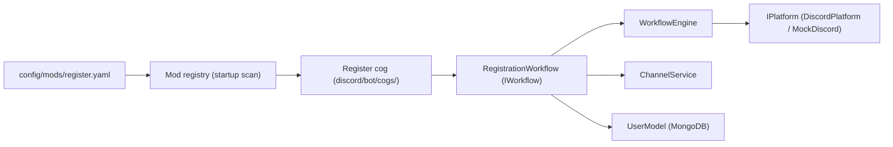

# Mod system design

This document describes the **design** of the mod system. For how to
document a mod (rules, environment), see [../MODS/README.md](../MODS/README.md)
— this page is the architecture-facing counterpart.

## What is a mod?

A mod is a self-contained game feature (register, ladder, clans, ...)
built on the generic core. A mod:

- declares its configuration in YAML
  (`kingdoms-services/config/mods/<mod>.yaml`): enabled flag, per-mod
  settings, channel categories, roles
- implements its logic against the core only (`IPlatform`,
  `WorkflowEngine`, `ChannelService`) — never against discord.py directly
- documents its rules and environment in `docs/MODS/<mod-name>/`

The YAML mod declarations act as the **mod registry**: the bot reads
`config/mods/*.yaml` at startup and loads every mod with `enabled: true`.
Mods are discovered by config, not by code imports.

## Mod anatomy

Components:

| Component | Lives in | Role |
| --------- | -------- | ---- |
| YAML declaration | `kingdoms-services/config/mods/<mod>.yaml` | Enabled flag, settings, categories, roles |
| Cog | `discord/bot/cogs/<mod>.py` | Maps commands/interactions to core services; no game logic |
| Workflow | mod implementation | Multi-step logic as `IWorkflow`, executed by the engine |
| Docs | `docs/MODS/<mod-name>/` | Rules and environment, game-designer owned |

## Lifecycle

1. **Load**: the bot scans `config/mods/*.yaml` at startup and registers
   every enabled mod
2. **Initialize**: the mod registers its commands, workflows, and channel
   categories; missing channels are created via `ChannelService`
3. **Execute**: user interactions drive the mod's workflows; state
   persists through the engine
4. **Cleanup**: on shutdown, in-flight workflows are persisted and resume
   on next start

A disabled mod (`enabled: false`) is skipped entirely: no commands, no
channels, no workflows. This is the kill switch for a misbehaving feature.

## Extension points

Mods extend the platform by combining core services:

| Want | Use |
| ---- | --- |
| New multi-step interaction | `IWorkflow` + `WorkflowEngine` |
| New message destination | `ChannelCategory` + `ChannelService` |
| New durable data | MongoDB model |
| New hot state | Redis key via `StateService` |
| New user-facing strings | YAML locale file entries |

## Isolation rules

- A mod **may not** import another mod's code. Shared behavior goes into
  the core.
- A mod **may not** hardcode channel names or IDs; it declares categories.
- A mod **may not** read another mod's config; shared settings live in
  the core config.
- Cogs contain no game logic; they translate Discord events into core
  calls.

These rules keep mods independently testable, documentable, and
removable.

## See also

- [../MODS/README.md](../MODS/README.md) — documentation-facing mod guide
  and available mods
- [core.md](core.md) — core services design
- [discord.md](discord.md) — UI components and `custom_id` routing
- kingdoms-services#20 (mod system), kingdoms-services#19 (clans),
  kingdoms-services#21 (admin)
