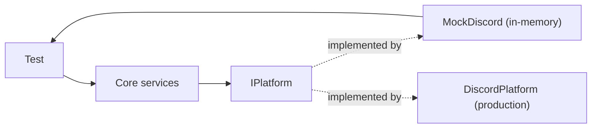

# Testing strategy

This document describes the Kingdoms testing strategy: `MockDiscord`,
the test pyramid, and the rules that keep tests hermetic. The framework
itself will be implemented in `kingdoms-services`
(kingdoms-services#2, kingdoms-services#24); this page is the reference
the implementation must follow.

## Principles

1. **No test touches the real Discord API.** All platform I/O goes through
   `IPlatform`; tests inject `MockDiscord`.
2. **The core is the test surface.** Because the core is platform-agnostic
   (see [ADR-001](../DECISIONS/001-multi-platform-architecture.md)), most
   tests run without any Discord concept.
3. **Game rules are testable as workflows.** Each workflow transition is a
   deterministic unit; the docs in `docs/MODS/<mod>/RULES.md` are the
   source of the expected behaviors.

## MockDiscord

`MockDiscord` is an in-memory `IPlatform` implementation:

- `send_message` / `send_dm` record sent messages in lists the test can
  assert on
- `create_channel` / `assign_role` mutate an in-memory guild model
- interactions are simulated by calling the same entry points the real bot
  uses, so the routing logic (including `custom_id` parsing) is exercised

What MockDiscord must expose (contract):

| Capability | Assertion surface |
| ---------- | ----------------- |
| Sent messages / DMs | ordered list of messages per channel/user |
| Created channels | list of channels per `ChannelCategory` |
| Assigned roles | per-user role set |
| Interaction routing | callback registry driven by `custom_id` |

## Test pyramid

| Level | Scope | Runs against | CI gate |
| ----- | ----- | ------------ | ------- |
| Unit | Core services, models, ELO math | Pure Python, fakes | every PR |
| Integration | Workflows end-to-end via `WorkflowEngine` | MockDiscord + MongoDB/Redis testcontainers (or in-memory fakes) | every PR |
| Smoke | Bot boots, mods load, commands register | MockDiscord | every PR |
| Manual | UX, permissions on a real server | dev Discord server | pre-release |

Unit tests for core services are tracked in kingdoms-services#22;
the MockDiscord framework in kingdoms-services#2 and #24.

## Rules

- Tests never sleep on wall-clock time; timeouts are injected as
  test-controlled clocks.
- Locale files used in tests ship with the test fixtures; tests do not
  read production config.
- Any bug fix ships with the test that would have caught it.

## See also

- [core.md](core.md) — core services design
- [ADR-0001](../DECISIONS/001-multi-platform-architecture.md) —
  testability as a reason for `IPlatform`
- [../VIBEWORKFLOW.md](../VIBEWORKFLOW.md) — where tests run in the
  session loop
